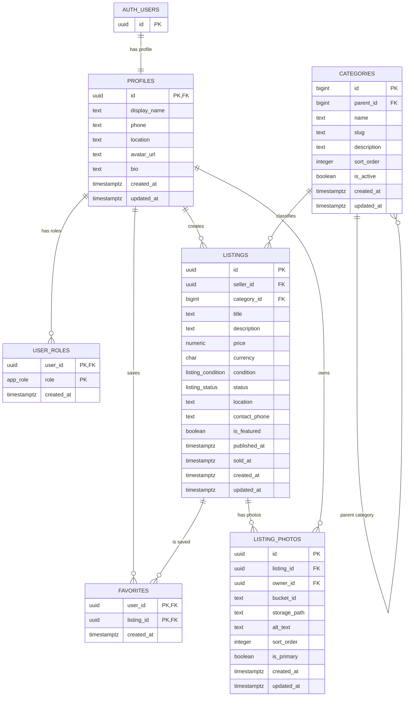

# NOTOLX Supabase Database

This document describes the initial NOTOLX marketplace schema defined in:

`supabase/migrations/20260711201302_initial_notolx_schema.sql`

## Tables

### `profiles`

Stores public account profile data for Supabase Auth users.

Key fields:

- `id`: Primary key and foreign key to `auth.users.id`.
- `display_name`: Public seller or buyer name.
- `phone`, `location`, `avatar_url`, `bio`: Optional profile metadata.
- `created_at`, `updated_at`: Audit timestamps.

### `user_roles`

Stores app-level roles for users.

Key fields:

- `user_id`: Foreign key to `profiles.id`.
- `role`: `app_role` enum, currently `user` or `admin`.
- Primary key: `(user_id, role)`.

### `categories`

Stores listing categories and optional parent/child category hierarchy.

Key fields:

- `id`: Identity primary key.
- `parent_id`: Optional self-reference to another category.
- `name`, `slug`, `description`: Category display and URL data.
- `sort_order`, `is_active`: Display ordering and visibility.

Seeded categories:

- Phones
- Cars
- Home
- Electronics
- Fashion
- Sports
- Jobs
- Pets

### `listings`

Stores marketplace listings.

Key fields:

- `id`: UUID primary key.
- `seller_id`: Foreign key to `profiles.id`.
- `category_id`: Foreign key to `categories.id`.
- `title`, `description`, `price`, `currency`, `condition`, `status`, `location`.
- `contact_phone`: Optional listing-specific contact phone.
- `is_featured`: Featured listing flag.
- `published_at`, `sold_at`: Listing lifecycle timestamps.

Enums:

- `listing_status`: `draft`, `active`, `sold`, `archived`, `removed`.
- `listing_condition`: `new`, `like_new`, `good`, `fair`, `poor`.

### `listing_photos`

Stores metadata for photos uploaded to Supabase Storage.

Key fields:

- `id`: UUID primary key.
- `listing_id`: Foreign key to `listings.id`.
- `owner_id`: Foreign key to `profiles.id`.
- `bucket_id`: Fixed to `listing-photos`.
- `storage_path`: Unique path in the storage bucket.
- `alt_text`, `sort_order`, `is_primary`.

### `favorites`

Stores saved listings for users.

Key fields:

- `user_id`: Foreign key to `profiles.id`.
- `listing_id`: Foreign key to `listings.id`.
- Primary key: `(user_id, listing_id)`.

## Relationships

- One Supabase Auth user has one `profile`.
- One `profile` can have many `user_roles`.
- One `profile` can create many `listings`.
- One `category` can have many child `categories`.
- One `category` can have many `listings`.
- One `listing` can have many `listing_photos`.
- One `profile` can own many `listing_photos`.
- One `profile` can favorite many `listings`.
- One `listing` can be favorited by many `profiles`.

## Indexes

The migration includes indexes for common marketplace access patterns:

- Role lookup by `user_roles.role`.
- Category hierarchy and active category ordering.
- Listing lookup by seller, category, status, creation date, and active category price.
- Full-text listing search across title, description, and location.
- Listing photo lookup by listing and owner.
- One primary photo per listing.
- Favorite lookup by listing and user creation date.

## Triggers

The migration defines:

- `public.set_updated_at()`: Shared trigger function for `updated_at`.
- `private.handle_new_user()`: Auth trigger function that creates a profile and default `user` role after a Supabase Auth user is inserted.

Tables with `updated_at` triggers:

- `profiles`
- `categories`
- `listings`
- `listing_photos`

## RLS Summary

RLS is enabled on all public app tables:

- `profiles`
- `user_roles`
- `categories`
- `listings`
- `listing_photos`
- `favorites`

General access model:

- Public users can read public profiles, active categories, active listings, active listing photos, and public storage files.
- Authenticated users can create and manage their own profile, listings, listing photos, and favorites.
- Users can only favorite active listings.
- Admin-only operations are checked through `private.is_admin()`.
- Admins can manage categories, roles, and other users' marketplace content.

The migration uses `TO anon` and `TO authenticated` clauses explicitly, and owner checks use `(select auth.uid())`.

## Storage

### `listing-photos`

Purpose: Public listing images.

Configuration:

- Public bucket: `true`
- File size limit: `10 MiB`
- Allowed MIME types: `image/jpeg`, `image/png`, `image/webp`

Path convention:

```text
{user_id}/{listing_id}/{filename}
```

Access summary:

- Public read access.
- Authenticated users can upload, update, and delete files under their own user folder.
- Upload and update policies also check listing ownership.
- Admins can update or delete listing photo objects.

### `avatars`

Purpose: Public profile avatars.

Configuration:

- Public bucket: `true`
- File size limit: `5 MiB`
- Allowed MIME types: `image/jpeg`, `image/png`, `image/webp`

Path convention:

```text
{user_id}/{filename}
```

Access summary:

- Public read access.
- Authenticated users can upload, update, and delete only their own avatar files.

## ER Diagram


